# Umbra Advanced Architecture

This document defines **Umbra**'s multi-layered, zero-trust, post-quantum, and censorship-resistant system architecture.

---

## 1. Extended Architecture Diagram

```mermaid
graph TD
    subgraph UI_Layer [User Interface & Visual Protection]
        AndroidUI[Android App: Compose + FLAG_SECURE + Keystore TEE]
        LinuxGUI[Linux GUI: GTK4 + Libadwaita Wayland-Only]
        LinuxTUI[Linux TUI: Ratatui Headless Terminal]
        ScratchReveal[Dynamic Masking: Scratch-to-Reveal]
        DecoyVault[Decoy Vault / Fake Profile]
    end

    subgraph Sandbox_Layer [Process & Kernel Isolation]
        Seccomp[Linux Seccomp-BPF Syscall Filter]
        Landlock[Landlock LSM: Zero File System Access]
        SecureMem[mlock & Guard Pages & Zeroize]
    end

    subgraph Core_Engine [Umbra Rust Core Engine]
        Controller[App Controller & Event Loop]
        
        subgraph Crypto_Module [Post-Quantum Cryptography]
            PQKEM[ML-KEM-768 Kyber]
            PQDSA[ML-DSA-65 Dilithium]
            ClassicDH[X25519 DH]
            DoubleRatchet[Double Ratchet & ChaCha20-Poly1305]
            PQMLS[PQ-MLS TreeKEM Group Engine]
            ZkAttest[Zero-Knowledge Device Attestation]
        end

        subgraph Protocol_Module [Protocol & Metadata Masking]
            PacketFmt[1024-Byte Fixed-Block Packetizer]
            CoverTraffic[Poisson Artificial Cover Traffic Generator]
            MediaSanitizer[Deterministic Media Metadata Sanitizer]
            SMP_Auth[Socialist Millionaire Protocol & SAS]
        end

        subgraph Network_Router [Dynamic Network & Transport Router]
            ArtiTor[Embedded Arti Tor v3 Onion P2P]
            Pluggable[Pluggable Transports: Obfs4 / Snowflake]
            NymMix[Nym Mixnet / Loopix Delayed Mixer]
            OffGrid[Off-Grid Mesh: BLE / Wi-Fi Direct DTN]
        end

        subgraph Hardware_Bridge [Hardware Security Bridge]
            FIDO2[YubiKey / Nitrokey Hardware Security Key]
            TamperDetect[Accelerometer & Sudden Motion / Cable Guard]
        end
    end

    UI_Layer --> Sandbox_Layer
    Sandbox_Layer --> Core_Engine
    Hardware_Bridge --> Crypto_Module
    Crypto_Module --> Protocol_Module
    Protocol_Module --> Network_Router
    Network_Router <-->|Tor Circuit / Mixnet / Mesh| Peer[Destination Communication Node]
```

---

## 2. Advanced and Goal-Oriented Security Modules

1. **Zero-Click-Hardened, Doubly-Protected Subprocess (Out-of-Process Media Sanitizer):**
   - Against Pegasus zero-click exploits, images are never opened in the main process; they are parsed in a **single-use subprocess limited to 2 MB of RAM**, confined with `Landlock` zero file permissions and `Seccomp`, to extract pure RGB pixels.
2. **Encrypted-in-RAM Memory Rings & Cache Eviction:**
   - Messages and keys never remain in plaintext even in RAM; they are instantly encrypted with AES-NI, processed only in the CPU L1/L2 cache, and immediately evicted from the cache with `clflushopt`.
3. **Quad-Source Hybrid Entropy Generator (CSPRNG):**
   - Key seeds are produced from a combination of CPU RDRAND + Linux `getrandom` + accelerometer/touch jitter + the previous ephemeral secret; this provides resistance against single-source RNG manipulation.
4. **Post-Quantum Group Communication (PQ-MLS TreeKEM):**
   - Provides asynchronous, quantum-resistant, and logarithmically scaling ($O(\log N)$) group key distribution for multi-party secure cells and diplomatic delegations.
5. **Censorship-Resistant Networking and WTF-PAD Routing (Network Router):**
   - **Arti Tor v3** (Strict Vanguards-Lite Guard protection), **WTF-PAD Markov Padding** against DPI filters, **Obfs4 / Snowflake (WebRTC Masking)**, and **BLE / Wi-Fi Direct Mesh** kicking in during internet outages.
6. **Physical Security and Anti-Surveillance:**
   - Shoulder surfing is blocked via **Scratch-to-Reveal** dynamic masking.
   - Under coercion, **Decoy Vault** opens a deniable fake profile and the real keys are destroyed.
   - A mandatory **YubiKey / FIDO2** hardware key requirement provides full protection against physical device theft.
7. **24-Hour Universal Crypto-Shredding:**
   - Exactly 24 hours after being created or received, all messages, photos, videos, voice recordings, and documents are permanently erased at the forensic level by destroying their $EFK$ keys with reference to Tor Consensus Time and via NIST SP 800-88 3-layer overwriting.
