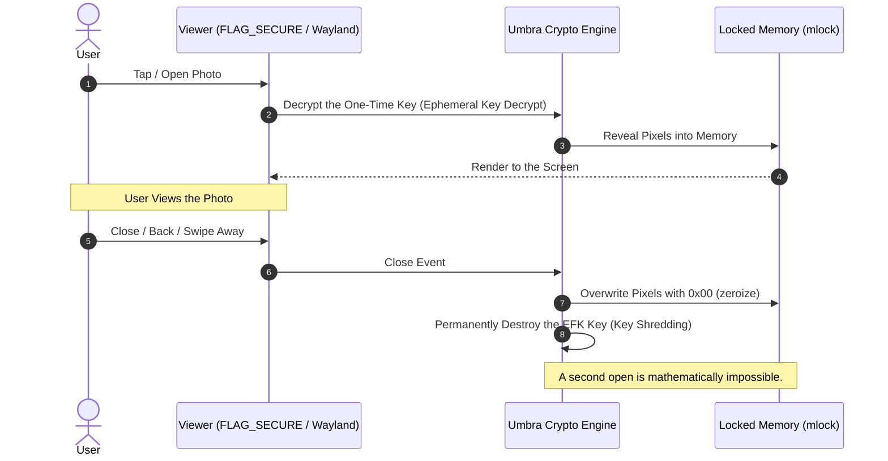
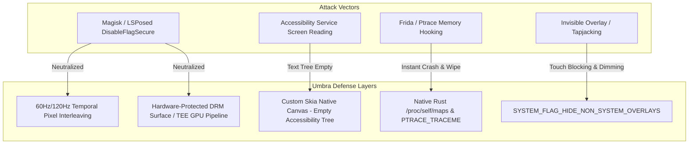
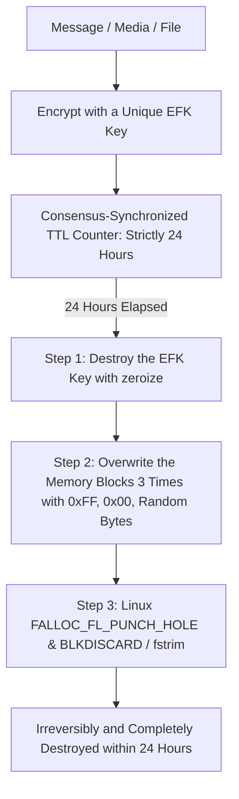
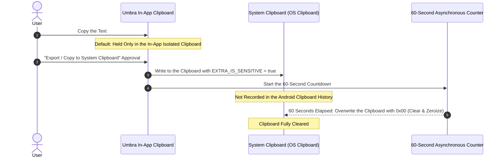
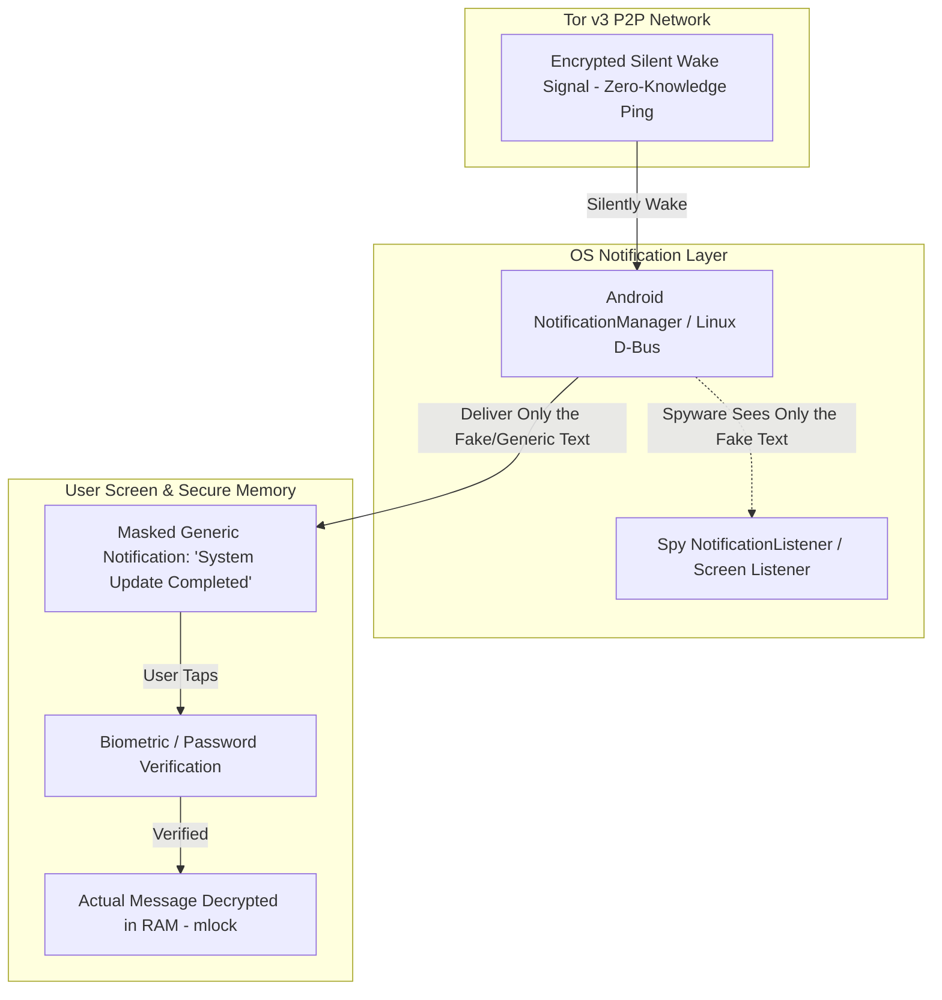
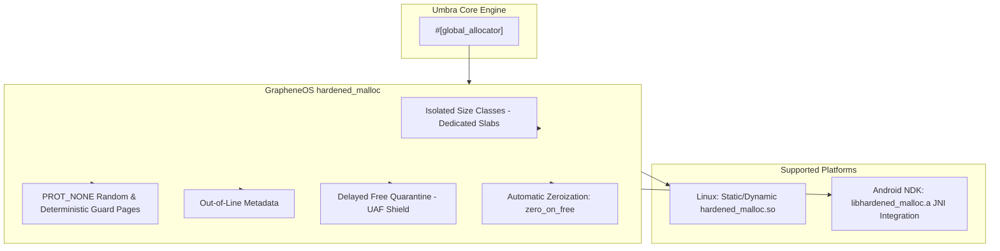

# Umbra Client and Operating System Security Specification (Ultra-Hardened Client Security)

This document describes the technical measures **Umbra** takes on the Linux and Android platforms against screen surveillance, memory dumps, spyware isolation, View-Once media, advanced screen-recording blocking, 7/10-day irreversible Crypto-Shredding, and physical coercion threats.

---

## 1. Default View-Once Media Engine

In Umbra, **ALL PHOTOS** sent and received are in **View-Once** mode by default:



- **Ephemeral Key Shredding:** Every photo is encrypted with a unique, single-use Ephemeral File Key ($EFK$). The moment the dialog is closed after the photo has been viewed, the $EFK$ key is destroyed by `zeroize`-ing it out of memory.
- **Zero Disk Writes:** Media files are never written to the disk cache (`cache`, `/tmp`, etc.); they are processed exclusively in RAM locked with `mlock`.
- **Impossibility of a Second Open:** Once the key is destroyed, the encrypted data turns into mathematically undecryptable random noise.

---

## 2. Android Advanced Screen and Surveillance Defense (Anti-FlagSecure-Bypass)

In the Android ecosystem, the `FLAG_SECURE` flag can easily be bypassed with root privileges (Magisk/KernelSU), Xposed/LSPosed modules (`DisableFlagSecure`), Frida runtime hooking, or `AccessibilityService` exploitation. Refusing to trust operating-system flags, Umbra applies a **Defense-in-Depth** architecture:



### A. Temporal Pixel Interleaving and Frame Splitting
- On-screen text and photos are **never drawn** as a static Bitmap.
- **Mechanism:** The image is split into two complementary half-frames and pushed to the screen sequentially at a 60Hz/120Hz frequency.
- **Attack Prevention:** The human eye's perception threshold (Persistence of Vision) fuses the image perfectly and sharply. However, since spyware that bypasses `FLAG_SECURE` and takes screenshots or records the screen captures only a single static frame (1 frame), it obtains **nothing but meaningless noise and half-pixel lines**.

### B. Accessibility Shielding and Custom Drawing Engine
- Spyware (Pegasus et al.) and banking trojans copy on-screen text from Android's `AccessibilityService` tree (`AccessibilityNodeInfo`).
- **Defense:** Standard Android `TextView`, `EditText`, or Compose `Text` components are not used. All text is drawn directly at the pixel level through the Rust/C++ Skia engine.
- **Result:** When accessibility services query the screen, they can see no text at all; the system reports the screen as a completely "Blank Canvas".

### C. Hardware-Protected DRM Surface (TEE Pipeline)
- Images and videos are drawn via OpenGL ES / Vulkan into hardware buffers protected by `SurfaceHolder.SURFACE_TYPE_HARDWARE` and `FLAG_HW_SECURE`.
- The drawings are encrypted at the GPU and hardware TEE (TrustZone) level. Even if the device is rooted and `SurfaceFlinger` is patched, a direct GPU memory dump yields only an encrypted black frame.

### D. Native-Level Anti-Hook, Anti-Root, and Anti-Frida Detection
- To bypass hooks in the Java/ART layer, directly in the **pure Rust native layer**:
  1. **`ptrace(PTRACE_TRACEME)`:** As soon as the app starts, it traces itself; Frida, GDB, or LLDB cannot attach from the outside.
  2. **Memory Map Scan:** `/proc/self/maps` is scanned to detect the presence of the `lsposed`, `xposed`, `substrate`, and `frida-agent` libraries.
  3. **Breach Action:** The instant any dynamic injection or `FLAG_SECURE` manipulation is detected, the app **zeroizes all RAM within 1 millisecond (`zeroize`) and terminates the process (`SIGKILL`)**.

### E. Overlay and Tapjacking Blocking
- `View.setFilterTouchesWhenObscured(true)` and `WindowManager.LayoutParams.SYSTEM_FLAG_HIDE_NON_SYSTEM_OVERLAYS` are activated.
- All third-party windows that place transparent or partial overlays on top of the app window are blocked at the operating-system level.

---

## 3. Linux Wayland Strict Isolation

1. **X11 Strictly Prohibited:** Refuses outright to run under X11 (`WAYLAND_DISPLAY` validation).
2. **PipeWire / ScreenCast Portal Restriction:** Umbra's window surfaces (Wayland Surfaces) are prevented from being included in screen-capture streams via the `org.freedesktop.portal.ScreenCast` and `wlr-screencopy` protocols.

---

## 3. Automatic Lifecycle and 24-Hour Irreversible Destruction Policy (Crypto-Shredding)

Nothing in Umbra persists forever. Without exception, **all data (messages, photos, videos, voice recordings, and documents)** is permanently destroyed **24 Hours (1 Day)** after it is created or received, **in a way that cannot be recovered even by forensic analysis**:

| Data Type | Default Retention Period (TTL) | Destruction Method |
|---|---|---|
| **Text Messages** | **24 Hours** | Dual-Layer Crypto-Shredding + RAM Zeroize |
| **Photos (Non-View-Once)** | **24 Hours** | NIST SP 800-88 3-Pass Overwrite + Key Shredding |
| **Videos and Voice Recordings** | **24 Hours** | NIST SP 800-88 3-Pass Overwrite + Key Shredding |
| **Other Files (PDF, Documents, Attachments)** | **24 Hours** | Gutmann 3-Pass Overwrite + `FALLOC_FL_PUNCH_HOLE` |
| **View-Once Photos** | **The Moment They Are Closed (Max 24 Hours)** | Instant $EFK$ Key Destruction & RAM `zeroize` |



### A. Crypto-Shredding
- Every object is encrypted with a unique **Ephemeral File Key ($EFK$)**.
- When 24 hours have elapsed ($T \ge 24\text{ Hours}$), the $EFK$ key is deleted from the key table and `zeroize`d.
- With its key destroyed, the encrypted data block turns into random noise that is undecryptable, theoretically and practically, until the end of the universe.

### B. Multi-Layer Secure Overwrite (NIST SP 800-88 / Gutmann Overwrite)
- Memory blocks slated for deletion are not released in a single pass; in sequence:
  1. written with `0xFF` (all bits 1),
  2. written with `0x00` (all bits 0),
  3. overwritten with cryptographically random noise bytes.
- On flash storage, `FALLOC_FL_PUNCH_HOLE` and `BLKDISCARD` (`fstrim`) calls are triggered to prevent block recovery.

### C. Anti-Clock Tampering
- To prevent an attacker from bypassing the 24-hour destruction mechanism by rolling the device clock back:
  - Elapsed-time computation does not trust the local system clock (Wall Clock).
  - Absolute time is computed from **Tor Consensus Network Time** and the differential of the hardware monotonic clock (`CLOCK_MONOTONIC_RAW`). Even if the clock is rolled back, the destruction mechanism triggers once 24 hours have elapsed.

---

## 4. Linux Process Isolation and Kernel Security

### A. Linux Seccomp-BPF Syscall Filtering
- As soon as the process starts, `seccomp(SECCOMP_SET_MODE_FILTER)` is engaged at the kernel level:
  - Process-injection and memory-surveillance calls such as `execve`, `execveat`, `ptrace`, `process_vm_readv`, and `process_vm_writev` are blocked (`EPERM` / `SIGSYS`).
  - Only the kernel system calls required for asynchronous networking and memory management are permitted.

### B. Zero Disk Access with Landlock LSM (Filesystem Sandbox)
- Using the Linux kernel's `Landlock` security module, the Umbra process's read and write access to the filesystem is reduced to absolute zero — with one documented exception: the controlling terminal `/dev/tty` (READ-only, for TUI status detection; drawing itself goes through the already-open stdout descriptor) (CLIENT sandbox implementation: `umbra-cli::sandbox`).

### C. Network Kill-Switch (DNS/IPv6 Seccomp Filter)
- The Seccomp allowlist does not grant `socket(2)` unconditionally: argument rules allow ONLY IPv4/UNIX **STREAM** sockets. IPv6 of any type, UDP of any family (including DNS :53), raw and netlink sockets fail with `EPERM` at the kernel syscall level (`umbra-cli::sandbox::restrict_syscalls`). This is verified hermetically in `sandbox_seccomp.rs::ipv6_and_udp_sockets_are_blocked`.
- Host-layer reference (defense in depth OUTSIDE the process; the embedded Arti client opens direct relay TCP per ADR-001, so an absolute host-level UDP/IPv6 DROP requires a process-scoped allowance, ADR-019):

```nft
table inet umbra_killswitch {
  chain output {
    type filter hook output priority 0; policy accept;
    udp dport 53 reject
    meta nfproto ipv6 drop
    tcp dport 53 reject
  }
}
```

### D. CPU Register Zeroing (`zero-call-used-regs`)
- Session commands are built with the LLVM `-C zero-call-used-regs=all` codegen rule on the NIGHTLY toolchain (`just secure-build`; enforced in the CI sanitizer job): every call boundary returns with call-used registers zeroed, shrinking register-residue leak surface.
- Residual: the flag is accepted on the nightly compiler channel only, so the pinned stable toolchain (main CI job, local stable builds) runs without it; the sanitizer job (nightly) is the enforcement point.

### E. Memory Locking (`mlock`) and Anti-Cold-Boot Security
- To prevent memory pages from being written to `/swapfile` or swap space, sensitive pages are locked with `mlock`; the process additionally calls `mlockall` and FAILS CLOSED (`umbra: syscall mlockall failed`) when the kernel refuses. Operators must raise `RLIMIT_MEMLOCK` (e.g. a systemd `LimitMEMLOCK=infinity` unit override or a raised ulimit) — an unprivileged environment with the default limit cannot run session commands, by design.
- **Canary Protection & Guard Pages:** `PROT_NONE` guard pages are placed around key memory blocks, so memory-overflow attacks are detected instantly.

---

## 5. Physical Surveillance and Coercion Defense

### A. Dynamic Masking (Scratch-to-Reveal / Anti-Shoulder Surfing)
- Messages sit on the screen as blurred blocks by default; when the user presses and holds with a finger, only the 2-3 words under the finger come into focus.

### B. Decoy Vault / Deniable Fake Profile
- When the **Duress PIN** is entered under coercion, a fake, harmless profile opens while the real keys and data are permanently destroyed in the background (`Duress Wipe`).

### C. Motion-Triggered Emergency Trigger (Motion / Tamper Wipe)
- An emergency sentinel that wipes RAM within 5 milliseconds when the device is forcibly snatched from the hand (a sudden accelerometer spike) or a USB cable is suddenly plugged in.

### D. Media Metadata Sanitizer (Deterministic Media Sanitizer)
- EXIF, GPS, camera serial numbers, and sensor noise are stripped from every image sent; the pixel matrix is re-encoded in memory before transmission.

---

## 6. Clipboard Security and 1-Minute Auto-Destruction (60-Second Ephemeral Clipboard)

Sensitive texts, keys, or coordinates left behind in the clipboard can easily be harvested by background spyware and keyboard services (GBoard et al.):



1. **60-Second Auto-Destruction (1-Minute Ephemeral Lifecycle):**
   - For any data handed to the system clipboard, a microsecond asynchronous counter starts in the background (`tokio::time::sleep` / Android `Handler`).
   - **At second 60**, the clipboard content is overwritten with an empty string and `0x00`, leaving it completely clean.
2. **Android Clipboard History Block (`EXTRA_IS_SENSITIVE`):**
   - On Android 13+, the `ClipDescription.EXTRA_IS_SENSITIVE = true` flag is added to the `ClipData` object.
   - This prevents the operating system from showing the copied data as an on-screen preview and from saving it to the system's Clipboard History database.
3. **In-App Isolated Pasteboard:**
   - Copy-paste operations inside the app are **strictly never** sent to the operating-system clipboard by default; they are kept solely in an isolated in-app buffer inside RAM protected by `mlock`.
4. **Linux Wayland Data Source Protection:**
   - The Wayland `wl_data_source` object is offered only to the focused window and, after 60 seconds, `wl_data_source_destroy` is called to remove it from memory.

---

## 7. Zero-Knowledge Masked Notifications Unreadable by the System (Zero-Knowledge Masked Notifications)

Standard notification systems (FCM, Apple APNs, Android `NotificationManager`, Linux D-Bus `org.freedesktop.Notifications`) expose notification content to the operating system and to spyware granted the `NotificationListenerService` permission. Umbra zeroes this leak:



1. **Zero-Knowledge Silent Wakeup:**
   - Signals arriving over the Tor network **never carry** the message text, sender alias, or avatar. The transmitted packet is merely an encrypted liveness and wakeup signal (*Encrypted Wakeup Ping*).
2. **Masked Generic Local Notifications:**
   - The title and text reported to the operating system are always **generic and misleading** (e.g., Title: *"System Service"*, Body: *"Background synchronization completed"*, or fake disguises the user can choose: *"Weather Report"*).
   - The real message text or sender identity is **never, under any circumstances, handed** to the Android `NotificationManager` or the Linux D-Bus notification server.
3. **Spyware and `NotificationListenerService` Shield:**
   - Even if other spyware or banking trojans on the device hold the notification-listening permission, they can read only the fake generic system message; they obtain zero metadata about real communication.
4. **Lockscreen Protection (`VISIBILITY_SECRET`):**
   - On Android, notification visibility is sealed as `Notification.VISIBILITY_SECRET`; no details or notification counts leak onto the lock screen.
5. **Post-Tap Decryption:**
   - When the notification is tapped, the app comes to the foreground and the user completes biometric (StrongBox/TEE) or PIN verification; only after this verification is the message momentarily drawn to the screen from `mlock`-ed RAM.

---

## 8. Kernel-Level Network Kill-Switch and Leak Prevention (Kernel-Level Hardware Kill-Switch)

DNS, IPv6, or WebRTC leaks can expose the IP address even in apps with the strongest encryption:

1. **Full-Stack Packet Filter (`nftables` / Android VpnService):**
   - On Linux via `nftables` / `iptables`, and on Android via the local `VpnService` loopback socket, a strict rule set is engaged:
   - **`DROP ALL` Rule:** **ALL** outbound and inbound TCP, UDP, ICMP, and raw packets — except those of the embedded Arti Tor client's `127.0.0.1` SOCKS/Onion port — are dropped instantly at the hardware/kernel level.
2. **IPv6 and WebRTC Leak Blocking:**
   - The operating system's IPv6 stack is disabled, or all IPv6 traffic is sealed as `::/0 -> DROP`.
   - Any third-party library attempting to open a direct socket is rejected instantly by the kernel.

---

## 9. Linux Kernel Hardening Parameters (Kernel Hardening Sysctl)

While the Umbra Linux client runs, it enforces the following kernel security parameters:

| Parameter | Value | Security Purpose |
|---|---|---|
| `kernel.kptr_restrict` | `2` | Completely hide kernel memory pointers from `/proc/kallsyms`. |
| `kernel.dmesg_restrict` | `1` | Prevent unauthorized users from reading kernel `dmesg` system logs. |
| `kernel.yama.ptrace_scope` | `3` | Ensure that no process (including root) can attach to other processes via `ptrace`. |
| `fs.protected_symlinks` | `1` | Block symbolic link (symlink) attacks. |
| `fs.protected_hardlinks` | `1` | Prevent hard link security vulnerabilities. |
| `net.ipv4.conf.all.rp_filter` | `1` | Reverse-path validation against IP spoofing attacks. |

---

## 10. GrapheneOS `hardened_malloc` Allocator Integration (Linux & Android)

Standard system allocators (`glibc malloc`, `jemalloc`, Android `scudo`) can fall short against heap overflow (*Heap Overflow*), Use-After-Free (UAF), Double-Free, and memory-metadata manipulation attacks. On both the Linux and Android platforms, Umbra uses the **GrapheneOS `hardened_malloc`** library as its primary global allocator (*Global Allocator*):



### A. Core Security Mechanisms
1. **Out-of-Line Metadata:** Memory-management headers are kept not adjacent to the allocated data but in separate, randomized memory regions protected by `PROT_NONE` pages; heap overflows therefore cannot corrupt the allocator structure.
2. **`PROT_NONE` Guard Pages:** Inaccessible pages are placed at randomized intervals around slab pools and large allocations; any buffer overflow (*Heap OOB*) instantly triggers `SIGSEGV`, halting the process.
3. **Quarantine Pools (Delayed Free Quarantine):** Freed (`free`) memory blocks are not reused immediately; they are held in a quarantine queue, thereby blocking Use-After-Free (UAF) exploits.
4. **Automatic Zeroization (`zero_on_free`):** All freed memory blocks are instantly overwritten with `0x00`; residual-memory-read (*Information Leak*) risks are eliminated.
5. **In-Heap ASLR (Fine-Grained Randomization):** Slab-internal allocation addresses are chosen at random, preventing an attacker from predicting the memory layout.

### B. Platform Implementation
- **Linux:** Statically linked into the Rust binary as `#[global_allocator]`, or executed with the compiled `hardened_malloc.so`.
- **Android:** `hardened_malloc` is statically linked into the Android native layer (`libumbra_native.so`), taking over JNI and Rust heap management.

---

## 11. Active Deception, Honeypot Memory Pages, and Ghost Mode

In the rare cases where a device is hooked at the hardware or zero-day level (hooking/compromise), Umbra engages deception mechanisms without the attacker noticing:

1. **Canary Memory Traps (Canary Keyrings):** Fake session tokens and decoy keys reside in memory. The microsecond a foreign process or hook touches these addresses, the real keys are destroyed (`Silent Suicide`), while fake encrypted streams continue to be fed to the attacker.
2. **Cryptographic Tar-Pits:** When the attacker tries to analyze the fake key packages, they are frozen under an endless load of PoW and mathematical computation.
3. **Hallucinated Fake Messages:** Under coercion and seizure, believable everyday family/dinner/weather fake messages are simulated in memory and the UI, concealing the fact that the real data has been destroyed.
4. **Ghost Mode:** When anti-debugging is detected, the app does not crash; it runs in an isolated shadow mode, producing fake control flows and fake success responses to deceive the attacker.
