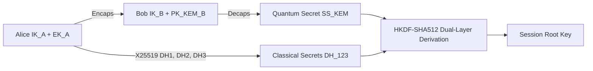

# Umbra Advanced Cryptography Specification

This document describes the post-quantum hybrid encryption mechanisms used by the **Umbra** protocol, its Post-Quantum digital signatures, its group communication model (PQ-MLS TreeKEM), and its deniability models.

---

## 1. Cryptographic Primitives

| Function | Algorithm | Library / Standard | Security Level |
|---|---|---|---|
| **Classical Key Exchange** | Curve25519 (X25519 ECDH) | `x25519-dalek` (RFC 7748) | 128-bit Classical |
| **Post-Quantum KEM** | ML-KEM-768 (CRYSTALS-Kyber-768) | NIST FIPS 203 (`ml-kem` — RustCrypto, pure Rust) | Level 3 (Quantum, AES-192 equivalent) |
| **Post-Quantum Signatures** | ML-DSA-65 (CRYSTALS-Dilithium-3) | NIST FIPS 204 (`ml-dsa` — RustCrypto, pure Rust) | Level 3 Quantum-Resilient |
| **Fallback Hash-Based Signature** | SLH-DSA / SPHINCS+ | NIST FIPS 205 (`slh-dsa` — RustCrypto, pure Rust) | Stateless Hash-Based (Zero Risk of Mathematical Attacks) |
| **Symmetric AEAD Encryption** | ChaCha20-Poly1305 | `chacha20poly1305` (RFC 8439) | 256-bit Authenticated Encryption |
| **Key Derivation (KDF)** | HKDF-SHA512 & BLAKE3 | `hkdf` / `blake3` | High-Entropy KDF |
| **Password-Based KDF** | Argon2id ($t=4, m=2^{18}, p=4$) | `argon2` (RFC 9106) | Memory-Hard (ASIC/GPU Protected) |
| **Constant-Time Equality** | Constant-Time Comparison | `subtle::ConstantTimeEq` | Constant-Time (AEAD verify path and SAS derivation verified by the dudect suite, `constant_time_tests.rs`; X25519/ML-KEM/ML-DSA rely on upstream constant-time implementations; SMP modexp is a documented non-CT residual) |

> **Note (ADR-026):** Due to the language policy, C-based `pqcrypto-*` (PQClean) wrappers are not used; for the post-quantum algorithms, only pure Rust RustCrypto implementations are mandated. FIPS 203/204/205 compliance is verified with Known-Answer Test (KAT) vectors.

---

## 2. Post-Quantum Hybrid Handshake (PQXDH)

Umbra implements the hybrid **PQXDH** protocol, which combines the strengths of classical and post-quantum algorithms:

1. **Hybrid Root Key Formula:**
   $$SK = \text{HKDF-SHA512}(DH_1 \parallel DH_2 \parallel DH_3 \parallel SS_{\text{ML-KEM}} \parallel \text{ContextInfo})$$
2. **Unbreakability Guarantee:**
   Even if an adversary solves the X25519 elliptic curve with a future quantum computer, they cannot reach the session secret as long as the ML-KEM lattice problem remains unsolved.

### 2.1 Double Ratchet Delivery Semantics

- The session root key boots the Signal-spec Double Ratchet (DH ratchet + symmetric chains; single-use message keys with deterministically derived nonces). Decryption is transactional (spec §3.5): on authentication failure all state changes are discarded.
- Out-of-order delivery decrypts via a bounded skipped-key store: message keys for gaps are pre-derived and held (max 128 per receiving chain, 256 total; oldest evicted first — a bounded-memory DoS trade-off). Replayed or evicted-too-old messages fail closed (`DecryptFailed`).
- A message lost beyond the store is unrecoverable **by design**: no automatic in-band resync exists — a new session must be established (fresh PQXDH handshake, same pairing; every messenger stream already opens one).

---

## 3. Post-Quantum Asynchronous Group Communication (PQ-MLS TreeKEM)

For multiple secure cells and diplomatic working groups, Umbra combines the IETF **Messaging Layer Security (MLS)** protocol with Post-Quantum TreeKEM:

- **Tree Structure (TreeKEM):** Group members are defined as leaf nodes in a binary key tree.
- **Logarithmic Scaling ($O(\log N)$):** When a member is removed from or added to the group, only the tree path is updated instead of re-distributing keys to the entire group from scratch.
- **Group Forward Secrecy:** A member who leaves the group cannot decrypt any subsequent message.

---

## 4. Anonymous Device Attestation with Zero-Knowledge Proofs (Zk-Attestation)

- When devices pair, the **Zk-SNARKs / Bulletproofs** mechanism is used to verify that the other party is a secure Umbra client.
- Without revealing its fingerprint or serial number, the device mathematically presents the proof *"I have a valid hardware/software configuration"*.

---

## 5. Socialist Millionaire Protocol (SMP) and SAS Verification

Against man-in-the-middle (MITM) attacks:
- If the two parties are physically side by side, a one-time dynamic **QR Code** is scanned.
- If the two parties are remote, a 6-digit visual/numeric **SAS (Short Authentication String)** code is used, or **SMP (Socialist Millionaire Protocol)** is run over a mutually shared secret password. SMP proves with zero knowledge that both parties know the same password, without disclosing it to the other party.
- Scope note: the SMP engine (`umbra-protocol::smp`, a faithful OTR v3 transcription) proves **shared-secret knowledge**. Its MITM value depends on the secret being authenticated out of band and on the identities bound into it: `smp::bound_secret` derives the pairing-level material from the shared password plus both parties' canonical identity fingerprints (`kdf::identity_fingerprint`, ML-DSA-VK+IK, 256-bit BLAKE3) taken from out-of-band-verified peer records, and the session driver additionally mixes the per-handshake transcript SSID (`Session::transcript_ssid`, BLAKE3 of the PQXDH blob) so a relay forwarding SMP messages verbatim between two distinct sessions fails on both sides. Residual: fingerprints are public and the password remains the root of trust — anyone holding the password passes SMP by design.
