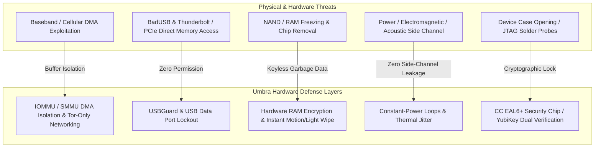

# Umbra Hardware Layer and Physical Security Specification (Hardware & Physical Security)

This document describes the end-to-end defense architecture that **Umbra** has developed against every hardware attack vector at the microchip, processor, memory module, Baseband, USB/DMA port, radio-frequency (RF), and physical-tamper levels.

---

## 1. Hardware-Level Threat Architecture and Isolation

---

## 2. Baseband and Cellular Network Isolation (Baseband Air-Gap & IMSI Defense)

- **Threat:** The cellular modem (Baseband Processor) in smartphones runs its own closed-source OS (RTOS) and can hold direct memory access (DMA) to the main Application Processor (AP). The target device can be remotely monitored via Stingray / IMSI-Catcher devices and Baseband zero-day exploits.
- **Targeted Defense:**
  1. **IOMMU / ARM SMMU Strict Isolation:** Direct access of the cellular modem and Wi-Fi chip to main system RAM is strictly restricted at the kernel level by the IOMMU (Input-Output Memory Management Unit).
  2. **Cellular Data Isolation & Hardware Network Kill-Switch:** All traffic flows only through encrypted Tor v3 circuits or the local P2P Mesh. No plaintext or metadata is transmitted over the cellular network; Wi-Fi MAC addresses are cryptographically randomized on every connection (*MAC Randomization*).

---

## 3. USB, DMA, and Hardware Port Defense (Anti-DMA & USBGuard)

- **Threat:** Malicious USB devices attached to the device (BadUSB, Rubber Ducky), Thunderbolt/PCIe devices, or law-enforcement forensic hardware (Cellebrite, GrayKey) can pull a direct memory dump (DMA) through the port.
- **Targeted Defense:**
  1. **Linux `USBGuard` Rule Set:** All unknown new USB devices are blocked outright at the kernel level (`block all unauthorized devices`).
  2. **Android USB Data Lockout:** While the device is locked, data communication over the USB port is shut down completely; only the safe charging protocol is permitted. The instant a USB debugging (ADB) connection is detected, the emergency memory wipe (*Duress Wipe*) kicks in.
  3. **PCIe / Thunderbolt DMA Lock:** Early-boot (early-boot) DMA attacks are blocked in the Linux kernel with the `intel_iommu=on` / `amd_iommu=on` and `efi=disable_early_pci_dma` flags.

---

## 4. Physical Tamper, Chip Removal, and Anti-Tamper Defense

- **Threat:** Opening the device's case in a laboratory setting, reading the RAM chips after freezing them (*Cold-Boot*), an optical laser probe, or probing the JTAG pins.
- **Targeted Defense:**
  1. **Hardware RAM Encryption (TME / SME & Encrypted Buffers):** All buffers held in RAM are protected by the CPU's hardware memory-encryption engine (AMD SME, Intel TME) and Umbra's instant AES-NI layer. Even if the chip is physically removed, the data read is random noise.
  2. **Sensor-Based Emergency Destruction (Hardware Tamper Triggers):**
     - When a sudden snatch/impact spike is detected on the device's accelerometer,
     - When the light sensor detects a sudden lumen spike indicating the case has been opened,
     - When the SIM tray is suddenly removed,
     - The Umbra core **wipes all sensitive keys with `zeroize` within 5 milliseconds** and terminates the process.

---

## 5. Physical Side-Channel and Emission Defense (Acoustic, Power & RF)

- **Threat:** Extraction of cryptographic keys through the device's power-consumption profile (DPA/CPA), electromagnetic emissions (SDR listeners), or high-frequency processor acoustic noise.
- **Targeted Defense:**
  1. **Constant-Power Loops:** During cryptographic operations, parallel dummy computation blocks are run to flatten the processor's current-draw profile.
  2. **Thermal and Timing Jitter Injection (Thermal Jitter Injection):** Microsecond asynchronous sleep intervals are injected so that processor temperature and frequency fluctuations cannot enable side-channel analysis.

---

## 6. External Hardware Security Module (FIDO2 / CC EAL6+ HSM)

- **Dual-Hardware Token Binding:**
  - In ultra-security mode, unlocking a session requires, in addition to the device's internal Secure Element (Android StrongBox / Linux TPM 2.0) chip, an external **CC EAL6+ certified FIDO2 / OpenPGP hardware key (YubiKey 5 / Nitrokey 3)**.
  - Even if the device is physically seized in full and the entire OS image is copied, no message can be decrypted without the physical NFC/USB hardware key.
