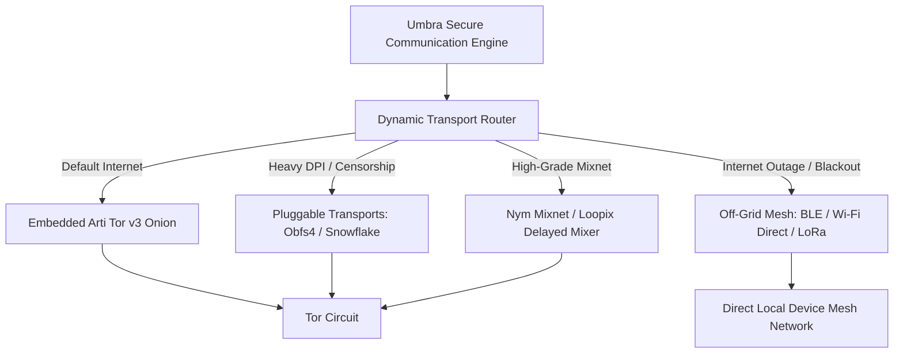

# Umbra Resilient Network Protocol

This document describes **Umbra**'s binary packet structure, its multiple anonymity networks (Tor/Nym Mixnet), the DPI-resistant Pluggable Transport layer, and the Off-Grid Mesh protocol that operates during internet outages.

---

## 1. Network Transport Architecture (Multi-Path and Censorship Resistance)



---

## 2. Binary Packet Structure (1024-Byte Fixed Block)

**EVERY** data packet passing over the network is **1024 Bytes** in length, without exception:

```
 0                   1                   2                   3
 0 1 2 3 4 5 6 7 8 9 0 1 2 3 4 5 6 7 8 9 0 1 2 3 4 5 6 7 8 9 0 1
+-+-+-+-+-+-+-+-+-+-+-+-+-+-+-+-+-+-+-+-+-+-+-+-+-+-+-+-+-+-+-+-+
|  Protocol Ver  |  Packet Type  |        Message Length        |
+-+-+-+-+-+-+-+-+-+-+-+-+-+-+-+-+-+-+-+-+-+-+-+-+-+-+-+-+-+-+-+-+
|                                                               |
|                   ChaCha20-Poly1305 Nonce                     |
|                           (12 Byte)                           |
+-+-+-+-+-+-+-+-+-+-+-+-+-+-+-+-+-+-+-+-+-+-+-+-+-+-+-+-+-+-+-+-+
|                                                               |
|                       Encrypted Payload                       |
|        (Actual Data + Cryptographic Random Padding)           |
|                         (992 Byte)                            |
+-+-+-+-+-+-+-+-+-+-+-+-+-+-+-+-+-+-+-+-+-+-+-+-+-+-+-+-+-+-+-+-+
|                                                               |
|                     Poly1305 Auth Tag (16 Byte)               |
+-+-+-+-+-+-+-+-+-+-+-+-+-+-+-+-+-+-+-+-+-+-+-+-+-+-+-+-+-+-+-+-+
```

---

## 3. Censorship Circumvention and Traffic Masking (Pluggable Transports)

To bypass censoring firewalls (e.g., the GFW) that apply state-level Deep Packet Inspection (DPI):
- **Obfs4 / Lyrebird:** Makes Tor packets appear as completely meaningless noise data with random entropy.
- **Snowflake (WebRTC Masking):** Disguises client traffic as an ordinary video conference or browser WebRTC stream and routes it through temporary volunteer proxies.

### The Umbra PT model (ADR-030, v2 line)

Umbra never spawns or links PT binaries. A pluggable transport runs as
an **OS-managed proxy process** exposing a **loopback-only SOCKS5
endpoint**; the embedded Arti client is configured with arti's
*unmanaged transport* support (`--pt-socks 127.0.0.1:PORT` plus
user-supplied `--bridge` lines or a `bridges` file next to the
keystore). This preserves the Seccomp no-`execve` allowlist, the
Landlock zero-FS sandbox, and the process-isolation doctrine. The
managed-PT (binary-spawning) model is rejected by design. Snowflake is
currently blocked: no Rust or C client implementation exists.

---

## 4. Internet Outage / Crisis Mode: Off-Grid Mesh

In crisis/wartime environments where the communication infrastructure has been crippled, the internet is cut off (blackout), or base stations have been shut down:
- **Bluetooth Low Energy (BLE) & Wi-Fi Direct:** Without internet, devices establish encrypted ad-hoc mesh networks with each other within a 50-100 meter radius.
- **DTN - Delay-Tolerant Routing / Store-and-Forward:** Even if the destination device is out of range, a message is delivered to its destination through intermediate nodes (other secure devices physically on the move) as sealed encrypted envelopes. Intermediate nodes can neither see the message's contents nor whom it belongs to.

---

## 5. Nym Mixnet Integration (`umbra-nym-cli`, separate `umbra-nym` binary)

Nym mixnet support LANDED as a single-message adaptation on top of Nym's own SDK (`nym-sdk` v1.21.6), not as a from-scratch Loopix/Sphinx reimplementation. Nym's SDK already implements the mixnet's packet mixing, Poisson-distributed sending delay, and cover traffic internally (`nym-client-core`); Umbra's adapter does not re-derive any of that layer — it hands the SDK one fully-assembled message per send and lets the SDK's own mix-network path handle reordering, delay, and cover packets end-to-end between sender and recipient gateways.

- **Duplex-bridge mechanism:** Umbra's existing session code — `umbra_net::messenger::send_text_stream` (sender side) and `receive_message` (recipient side) — is reused completely unmodified; both only require `AsyncWrite`/`AsyncRead` byte streams, not a specific transport. The adapter drives each one over an in-memory `tokio::io::duplex`: on send, `send_text_stream` writes the PQXDH/Double-Ratchet-sealed bytes into one end of the duplex, the adapter reads the accumulated bytes off the other end, and forwards them as exactly one Nym message; on receive, an incoming Nym message is written into a fresh duplex and `receive_message` reads it off the far end exactly as it would any other stream.
- **Persistent identity:** the Nym client uses on-disk persistent storage (`StoragePaths` rooted under the keystore config directory) so its Nym address survives process restarts, matching the `.onion` identity model rather than generating a new address per run.
- **Separate crate and binary:** this entire integration lives in `crates/umbra-nym-cli` (binary `umbra-nym`), a fully separate Cargo workspace — not a feature flag on the main `umbra` binary. See ADR-032 for why (a `links = "sqlite3"` Cargo dependency conflict between `nym-sdk`'s bandwidth-fetcher chain and the already-shipped Tor stack) and `crates/umbra-nym-cli/README.md` for its independent build/test commands.
- **Sandbox vs. mainnet:** by default the adapter targets Nym's Sandbox testnet; mainnet (real anonymity set, real bandwidth credentials) is available via `--mainnet` but is entirely outside this project's scope to acquire or manage credentials for — see `THREAT_MODEL.md`'s Nym-mode honest-scope note.
