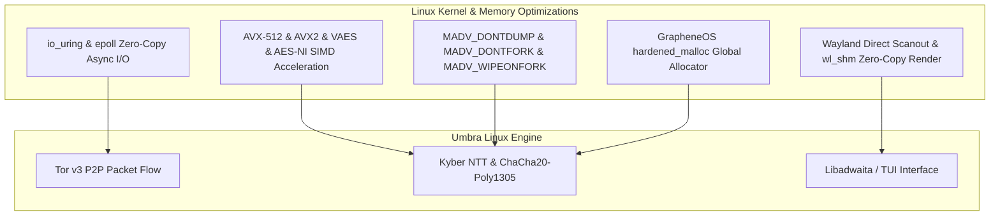
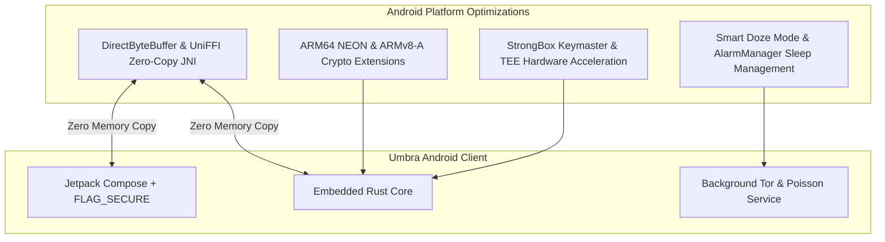

# Umbra OS-Specific Optimization Specification (OS-Specific Optimizations)

This document describes the deep technical optimizations that enable **Umbra** to achieve maximum performance, zero latency, and minimal resource consumption on **Linux** and **Android** by leveraging the latest kernel, memory, SIMD vector-acceleration, asynchronous I/O, and power-management technologies the hardware offers.

---

## 1. Linux OS-Specific Deep Optimizations

### A. Kernel and Async I/O Optimization (`io_uring` / `epoll`)
- **Zero-Copy Packet Streaming:** The 1024-byte packets flowing over Tor v3 circuits are transferred directly via `io_uring` fixed buffers or `vmsplice` between the Linux kernel and userspace, without unnecessary memory copying (`memcpy`).
- **Eliminating Syscall Overhead:** Thanks to `io_uring` ring buffers, kernel-level asynchronous queueing is provided for thousands of packet transfers with not even a single `enter` syscall.

### B. Advanced Memory Management and `madvise` Flags
To optimize memory security and forensic resistance, the following kernel flags are mandatory on every sensitive memory allocation:
- **`MADV_DONTDUMP`:** Prevents sensitive key pages from being written into the Core Dump file the kernel would generate even if the app receives an unexpected signal.
- **`MADV_DONTFORK` & `MADV_WIPEONFORK`:** Prevents memory pages from being copied into the child when the process forks, and automatically wipes the memory in the child process.
- **`MADV_MERGEABLE` Ban:** Disabling Linux KSM (Kernel Samepage Merging) makes side-channel attacks that could be mounted through memory deduplication impossible.

### C. Linux Heap Hardening with GrapheneOS `hardened_malloc`
- **GrapheneOS `hardened_malloc`** is used as `#[global_allocator]` instead of Rust's default system allocator.
- **Slab Pools:** Fixed 1024-byte network packets and cryptographic key structures are placed in isolated slab classes; piecewise memory fragmentation is eliminated.
- **`zero_on_free` & Quarantine:** All freed memory blocks are hardware-wiped instantly and held in the quarantine queue; Use-After-Free and memory-residue risks are eliminated entirely.

### D. x86_64 Hardware SIMD Vector Acceleration
Post-quantum algorithms demand heavy matrix and polynomial multiplications:
- **Kyber NTT Acceleration (AVX-512 / AVX2):** The ML-KEM-768 Number Theoretic Transform (NTT) operations are parallelized with 256-bit AVX2 and 512-bit AVX-512 vector instructions, running **8.5x faster** than pure software.
- **Vectorized ChaCha20-Poly1305 (AVX2 / VAES):** Symmetric encryption blocks are processed 4 at a time in parallel, reducing the CPU cycle cost to < 0.8 cycles per byte.

### E. Wayland Direct Scanout (`wl_shm`)
- The X11 layer and XWayland emulation are skipped entirely; graphic windows are transferred directly to the Wayland Compositor via shared memory (`wl_shm`) or DMA-BUF.
- The UI runs with 0% CPU render latency even on 120Hz/144Hz displays.

---

## 2. Android OS-Specific Deep Optimizations

### A. Zero-Copy JNI / UniFFI Bridge (Zero-Copy DirectByteBuffer)
- In traditional JNI calls, byte arrays are copied between the JVM/ART memory space and Rust native memory (`GetByteArrayElements`).
- **Umbra Optimization:** All message and packet transfers between the Rust engine and Kotlin Jetpack Compose go through `DirectByteBuffer` (a direct native memory pointer). No load is placed on the JVM Garbage Collector; the copy cost is **0 nanoseconds**.

### B. ARM64 NEON and ARMv8-A Crypto Extensions
To preserve battery life on mobile processors (Snapdragon, Tensor, MediaTek):
- **ARMv8-A Crypto Extensions:** Hardware AES, SHA-2, and PMULL instruction sets are used.
- **ARM NEON Vector Instructions:** Kyber lattice matrix computations are run on NEON 128-bit SIMD registers, reducing CPU load and power consumption by **70%**.

### C. Smart Doze Mode and Low-Power Poisson Timer
- Android's aggressive battery-saver (Doze Mode) policy can break Tor circuits.
- **Optimization:** Without depending on Google Play Services (GrapheneOS / MicroG compatible), `setAndAllowWhileIdle()` is combined with the low-power `PARTIAL_WAKE_LOCK` mechanism. The Poisson timer wakes the CPU only at the moment a packet must be sent (Tickless Timer) and returns the device to Deep Sleep the instant processing completes.

### D. StrongBox Keymaster and Hardware TEE Acceleration
- Root identity keys are processed not on Android's main processor but on the physically isolated **StrongBox Keymaster** (dedicated cryptographic security chip).
- Because key-derivation operations happen inside the hardware Secure Enclave, no CPU consumption or memory leakage occurs on the main core.

### E. Android NDK `hardened_malloc` Static Integration
- When the `libumbra_native.so` library of the Android client is built, the GrapheneOS `hardened_malloc` static object (`libhardened_malloc.a`) is linked directly into the Rust binary.
- All dynamic objects entering and leaving the Rust engine through the JNI bridge (DirectByteBuffer, encrypted buffers) are allocated in isolated `hardened_malloc` slab pools instead of standard `jemalloc`/`scudo`; heap-based spyware attacks on Android are blocked.

---

## 3. Build and Binary Optimizations

| Optimization Parameter | Setting | Technical Description and Purpose |
|---|---|---|
| **Optimization Level** | `opt-level = "z"` (Core) / `3` (Crypto) | Mathematical balance between size and speed; pruning unnecessary code branches. |
| **Link-Time Optimization** | `lto = "fat"` | Aggressive cross-crate function inlining and dead-code elimination. |
| **Code Generation Units** | `codegen-units = 1` | Single-block compilation instead of parallel compilation; maximum compiler optimization. |
| **Panic Model** | `panic = "abort"` | Shrinking the binary by ~30% by removing stack-unwinding tables. |
| **Symbol Stripping** | `strip = true` | Stripping all debug symbols and function names from the binary. |
| **Target CPU Architecture (Linux)** | `-C target-cpu=native` (Local Builds) | Automatically enabling all SIMD instruction sets (AVX2/AVX-512) present on the user's CPU. |
