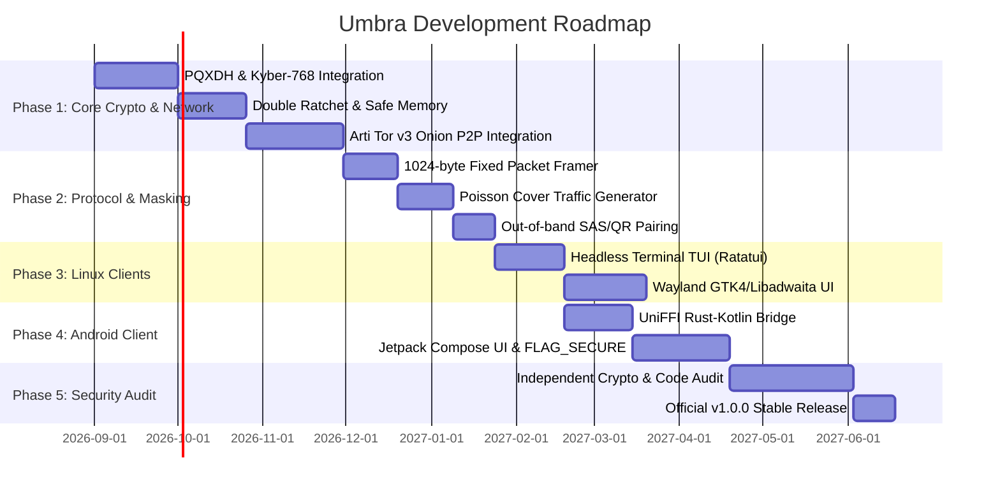

# Umbra Development Roadmap

This document summarizes the development phases, milestones, and release targets of **Umbra**.

---

## 🎯 Development Phases

---

## 📅 Phase Details

### Phase 1: Core Cryptography & Network Engine (`umbra-core`)
- [ ] Post-Quantum KEM (ML-KEM-768) and X25519 hybrid handshake.
- [ ] Double Ratchet key rotation and ChaCha20-Poly1305 encryption.
- [ ] Secure memory protection with `zeroize` and `mlock`.
- [ ] Pure-Rust Tor v3 Hidden Service socket listening and connecting via `arti-client`.

### Phase 2: Protocol and Metadata Masking (`umbra-protocol`)
- [ ] Fixed 1024-byte packet framing and random padding mechanism.
- [ ] Poisson-distributed artificial cover-traffic generator.
- [ ] One-time QR Code and Short Authentication String (SAS) pairing engine.

### Phase 3: Linux Clients (`umbra-linux`)
- [ ] Security-focused, low-resource Terminal TUI (`Ratatui`).
- [ ] Wayland-mandatory modern GNOME desktop UI (`GTK4` / `Libadwaita`).
- [ ] Linux swap-leak prevention with `mlock`.

### Phase 4: Android Client (`umbra-android`)
- [ ] Building the Rust core for the Android NDK and `UniFFI` bindings.
- [ ] Modern `Jetpack Compose` UI.
- [ ] `FLAG_SECURE` screenshot and video-recording block.
- [ ] Hardware-backed Android Keystore biometric key protection.

### Phase 5: Independent Security Audit & v1.0.0
- [ ] Third-party cryptography and penetration-test audit.
- [ ] Stable v1.0.0 open-source release and F-Droid / APK distribution.

---

## 📌 Scope and Priority Note (ADR-027)

- **v1.0 (MVP):** Phases 1–3 are limited to core crypto, Arti P2P, protocol masking, and the **Linux TUI**; details are in `TODO.md` Section A. Durations in the Gantt chart are targets and are revised according to independent audit findings.
- **v2 and later:** Phase 4 (Android) and Phase 5, together with the GTK4 GUI, BLE/Wi-Fi Direct mesh, Obfs4/Snowflake, Nym adapter, PQ-MLS TreeKEM, active deception layer, and hardware side-channel defenses are planned; details are in `TODO.md` Section B.
