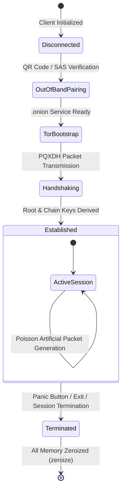

# Umbra Technical Wire Specification

This document defines the byte-level packet format, the state machine transitions, and the FFI interface definitions of the **Umbra** communication protocol.

---

## 1. 1024-Byte Binary Packet Layout

Every packet transmitted over the network, regardless of its type, is strictly of a fixed length of **1024 Bytes (8192 Bits)**.

| Offset (Byte) | Field Name | Type | Size | Description |
|---|---|---|---|---|
| `0x000` | `MAGIC_HEADER` | `[u8; 2]` | 2 Byte | Protocol magic bytes: `0x55, 0x4D` (`"UM"`) |
| `0x002` | `PROTOCOL_VERSION` | `u8` | 1 Byte | Protocol version: `0x01` |
| `0x003` | `PACKET_TYPE` | `u8` | 1 Byte | Packet type opcode (Opcode) |
| `0x004` | `PAYLOAD_LEN` | `u16` | 2 Byte | Byte length of the actual payload ($0 \le N \le 990$) |
| `0x006` | `CHACHA_NONCE` | `[u8; 12]` | 12 Byte | 96-bit single-use random nonce for ChaCha20-Poly1305 |
| `0x012` | `ENCRYPTED_DATA` | `[u8; 990]` | 990 Byte | Encrypted payload (Actual Data + Cryptographic Random Padding) |
| `0x3F0` | `POLY1305_TAG` | `[u8; 16]` | 16 Byte | 128-bit Poly1305 Auth Tag |

> **Revision note (wire-format arithmetic):** The original revision of this
> table specified `ENCRYPTED_DATA` as 992 bytes at `0x012` with a 16-byte
> tag at `0x3F2`, which sums to 1026 bytes — 2 bytes beyond the mandated
> 1024-byte packet. The layout above resolves the inconsistency
> arithmetically: `18 (header) + 990 (encrypted data) + 16 (tag) = 1024`.
> This matches the reference implementation in `crates/umbra-protocol`
> (`types.rs`: `HEADER_LEN`, `BODY_LEN`, `TAG_LEN`).

> **Chunking note (`HANDSHAKE_INIT`):** The PQXDH initial blob
> ($IK_A \parallel EK_A \parallel CT_{\text{ML-KEM}}$) is 1152 bytes
> (32 + 32 + 1088), which exceeds the 990-byte payload budget of a single
> packet. The transport layer therefore fragments the initial handshake
> across consecutive `HANDSHAKE_INIT` packets (see `crates/umbra-net`).

### Packet Types (Opcodes):
- `0x01`: `HANDSHAKE_INIT` — PQXDH initiation packet from Alice to Bob ($IK_A \parallel EK_A \parallel CT_{\text{ML-KEM}}$).
- `0x02`: `HANDSHAKE_RESP` — PQXDH response packet from Bob to Alice ($EK_B \parallel \text{ConfirmTag}$).
- `0x03`: `DATA_MESSAGE` — End-to-end encrypted user text (default 24-hour TTL).
- `0x04`: `DUMMY_COVER` — Poisson artificial cover traffic packet. The receiver silently destroys it from RAM after decryption.
- `0x05`: `VIEW_ONCE_PHOTO` — View-Once photo packet (keyed with a single-use $EFK$, max 24 hours).
- `0x06`: `MEDIA_CHUNK` — 24-hour video/audio or file chunk (keyed with $EFK$).
- `0x07`: `MEDIA_SHRED_ACK` — Destruction acknowledgment signal indicating the media was opened once and destroyed.
- `0x08`: `HEARTBEAT_PING` — P2P Tor circuit liveness check packet.
- `0x09`: `SESSION_TERMINATE` — Signal to close the session and mutually reset the ephemeral keys (`zeroize`).

---

## 2. Protocol State Machine



---

## 3. UniFFI / Kotlin Safe Bridge Interface (FFI Specification)

Type-safe communication between the Android Jetpack Compose UI and the Rust core:

```rust
// Umbra UniFFI Interface Definition
pub trait UmbraCoreController: Send + Sync {
    /// Generates a new ephemeral identity and a Tor v3 Onion endpoint
    fn initialize_identity() -> Result<IdentityKeys, CoreError>;
    
    /// Generates the one-time pairing QR data
    fn generate_pairing_payload(&self) -> Result<String, CoreError>;
    
    /// Processes the peer's QR data and initiates the secure handshake
    fn connect_peer(&self, peer_payload: String) -> Result<(), CoreError>;
    
    /// Sends an end-to-end encrypted, fixed-size packet message
    fn send_message(&self, recipient_onion: String, content: String) -> Result<(), CoreError>;
    
    /// Panic button: Wipes all memory and terminates all sessions
    fn trigger_panic_wipe(&self);
}
```

## Local Pipe Transport (v1.0 addition)

As a transport-agnostic core, `umbra send`/`umbra recv` accept and emit
the sealed stream over the standard Unix pipes instead of Tor. The pipe
framing is:

```text
[u32 BE handshake-blob length][PQXDH handshake blob]
[1024-byte sealed packets...]            (DATA_MESSAGE frames)
[1024-byte sealed packet]                (SESSION_TERMINATE, opcode 0x09)
```

Notes:
- Each sealed frame is a full 1024-byte packet exactly as specified
  above; only the handshake blob is length-prefixed (it predates the
  established session and cannot ride the session layer).
- The responder side of the pipe performs no initiator authentication;
  SAS verification (Socialist Millionaire Protocol, fingerprint-bound
  via `smp::bound_secret` and the transcript SSID) is mandatory before
  the channel is trusted, and the pipe layer runs no SMP at all.
- `--json` swaps the binary frames for NDJSON events (`handshake`,
  `packet`, `terminate` from the sender; `text`, `terminate` from the
  receiver) with base64url `data` fields.
