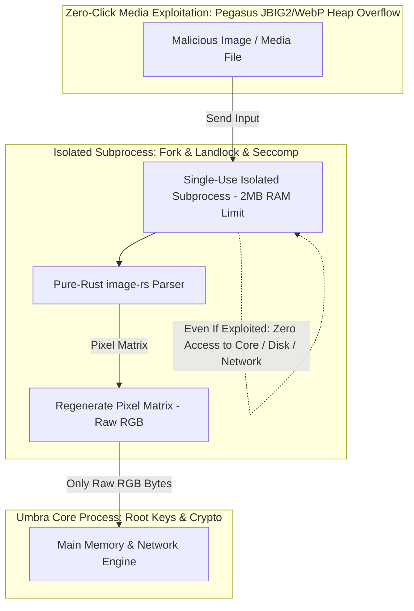
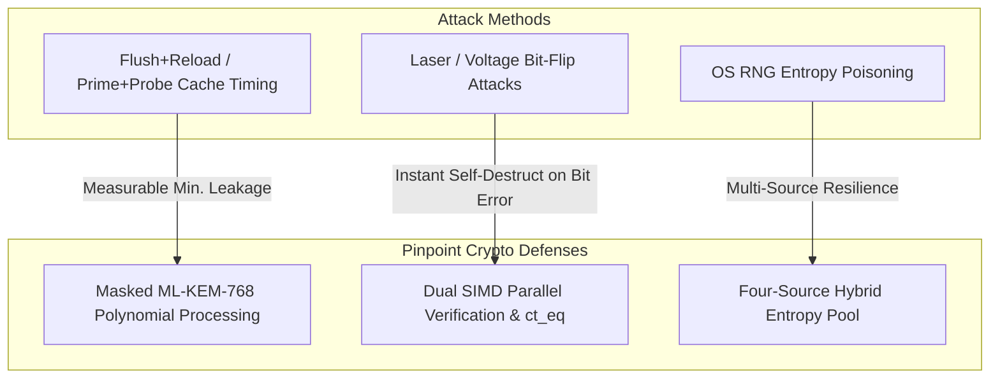
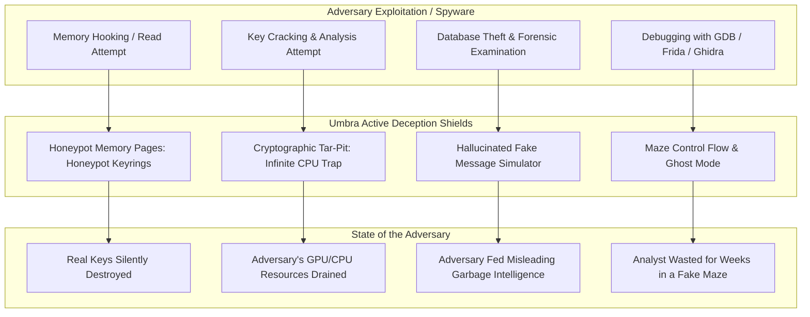

# Umbra Targeted Defense and Vulnerability Prevention Specification (Targeted Threat Defenses)

Instead of generic security advice, this document describes the **pinpoint defense mechanisms** that **Umbra** has developed against the **specific attack vectors** used by nation-state intelligence services, zero-day (0-Day) exploit operators, and advanced cyber threat actors (APTs), all operating at a low performance cost.

> **Scope Note (ADR-027):** Most of the defenses in this document fall within the v2+ scope. For the v1.0 (MVP) scope and priorities, see `TODO.md` Section A.

---

## 1. Memory & In-Process Vulnerability Defense (Memory & In-Process Defenses)

### A. Double-Shielded Isolated Parser Against Zero-Click Media Vulnerabilities (Out-of-Process Media Sanitizer)
- **Targeted Attack:** The heap-overflow (*Heap Overflow*) and integer-overflow (*Integer Overflow*) exploits in image-parsing libraries (libpng, libjpeg, WebP, JBIG2) used by Pegasus (*FORCEDENTRY*), NSO Group, and state-sponsored spyware.
- **Targeted Defense Mechanism:**
  1. The main process **never parses image or media files directly**.
  2. For every incoming media file, a single-use subprocess is launched (*Ephemerally-Forked Sandbox Process*) with disk access zeroed out via `Landlock`, network/process calls blocked via `Seccomp`, and a **2 MB RAM cap** imposed by Linux `cgroups`.
  3. The image is opened inside this isolated cage with the pure Safe Rust parser (`image-rs`); only the raw pixel RGB matrix is filtered out and passed to the main process.
  4. Even if the subprocess is exploited, it cannot physically reach key memory, the network socket, or the filesystem; when processing finishes, the subprocess is instantly destroyed by the kernel.

### B. Encrypted-in-RAM Memory Rings (Encrypted-in-RAM & Cache-Line Eviction)
- **Targeted Attack:** Malware running at root/kernel level pulling a direct RAM dump via `/proc/$PID/mem` or `/dev/kmem`; memory-freezing (*Cold-Boot*) attacks.
- **Targeted Defense Mechanism:**
  1. Messages and sensitive keys are never stored in RAM as plaintext (*plaintext*).
  2. All memory blocks are held in buffers encrypted on the fly with hardware AES-NI / ChaCha20 under a temporary session key (*Encrypted Ring Buffers*).
  3. Data is decrypted only in the nanosecond it is pulled into the CPU L1/L2 cache and is evicted directly from the CPU cache with the `clflushopt` / `arm64 dc civac` instruction the moment processing completes.

---

## 2. Cryptographic Side-Channel & Hardware Fault Defense (Side-Channel & Hardware Faults)

### A. Masked Quantum Cryptography and Constant-Time SIMD (First-Order Polynomial Masking)
- **Targeted Attack:** Reconstruction of the secret key by eavesdropping on the CPU's EM (electromagnetic) radiation and L1/L3 cache lines (*Flush+Reload*) during post-quantum ML-KEM (Kyber) polynomial multiplications and NTT transforms.
- **Targeted Defense Mechanism:**
  1. Secret polynomials are processed not directly in memory but as the sum of two polynomials split with a random mask ($P = P_1 \oplus P_2$) (*Masked Kyber*).
  2. All comparisons and matrix selections are executed in a single cycle with `subtle::Choice` and branchless (*Branchless*) AVX2/NEON instructions. The CPU never performs a data-dependent conditional jump (*branch jump*).

### B. Dual-Channel SIMD Execution and Bit-Flip Verification (Dual-Execution Fault Defense)
- **Targeted Attack:** Decrypting the key by flipping a single bit (Bit-Flip) during a crypto computation with Rowhammer or precise voltage manipulation.
- **Targeted Defense Mechanism:**
  - Every key-derivation and encryption operation is executed simultaneously on two independent SIMD pipelines.
  - Packets are not transmitted outward until the results are verified with `ct_eq`. At any moment of disagreement, the process triggers an emergency memory wipe (*Emergency Panic Wipe*).

### C. Quad-Source Hybrid Entropy Blending (Quad-Source Entropy Blending)
- **Targeted Attack:** Manipulation of the OS `/dev/urandom` pool, virtual-machine cloning, or hardware RNG backdoors (Dual_EC_DRBG-style).
- **Targeted Defense Mechanism:**
  - The random number generator (CSPRNG) is fed from three independent, isolated entropy sources plus a chained previous-ephemeral-secret value:
    $$\text{Seed} = \text{BLAKE3}\Big(\text{CPU RDRAND/RDSEED} \parallel \text{Linux getrandom()} \parallel \text{Accelerometer/Touch Jitter} \parallel \text{Previous Ephemeral Secret}\Big)$$
  - Under the design's entropy assumptions, even if three of the sources fail completely or are manipulated, the remaining sources are intended to keep the generated keys unpredictable (v2 hardware scope; verified against the real entropy sources when that phase lands).

---

## 3. Network & Traffic-Analysis Pinpoint Defense (Advanced Network Defenses)

### A. Adaptive WTF-PAD State Machine (Markov-Chain Adaptive Padding)
- **Targeted Attack:** ISP- or state-level DPI systems classifying packet sizes and arrival intervals with AI/machine-learning models to extract the identity of the person or application talking (*Website/Onion Traffic Fingerprinting*).
- **Targeted Defense Mechanism:**
  - Instead of static timers, the **WTF-PAD (Adaptive Padding)** Markov state machine takes over.
  - Inter-packet delays are tuned to dynamic probability distributions that make the target look like a genuine WebRTC video conference or ordinary web browsing. Effectiveness is measured with academic traffic-analysis benchmarks; the goal is to drive the accuracy of known fingerprinting classifiers down to random-guess level.

### B. Strict Vanguards-Lite Topology (Sybil & Guard Discovery Defense)
- **Targeted Attack:** The adversary opening thousands of malicious Tor relays to identify the target's Guard node and forcing the target through intermediate nodes under its control (*Guard Discovery Attack*).
- **Targeted Defense Mechanism:**
  - Standard random circuit building is abandoned; the **Vanguards-Lite** protocol is implemented inside Arti.
  - Entry nodes (Layer-1 and Layer-2 (arti 0.45 Vanguards-Lite reality: `G -> L2 -> M` with 1-12-day L2 rotation; a per-service Full/L3 upgrade is upstream arti #1382 — Umbra pins the mode explicitly so consensus cannot weaken it)) are pinned and tied to monthly rotation. The goal is to drive the probability of Sybil attackers manipulating the target's circuit down to the $10^{-6}$ level.

### C. Atomic MTU Locking (Anti-Fragmentation Leaks)
- **Targeted Attack:** Exposure of the real MTU size and the device-OS fingerprint through the ICMP messages or packet headers produced when packets are fragmented (*IP Fragmentation*) at network gateways.
- **Targeted Defense Mechanism:**
  - At the socket level, fragmentation is strictly forbidden with `IP_MTU_DISCOVER = IP_PMTUDISC_DO`.
  - Every packet is locked atomically at 1024 bytes so it fits hardware network frames (Ethernet/Wi-Fi/LTE Frame) exactly; fragmentation-based fingerprinting and ICMP leakage are blocked.

---

## 4. User Interface & Physical Side-Channel Defense (UI & Acoustic Defenses)

### A. Scrambled Virtual Keyboard and Touch Jitter (Anti-Acoustic/Motion Eavesdropping)
- **Targeted Attack:** Spyware reading the device's microphone or gyroscope/accelerometer data learning the typed password from key sounds or screen shake.
- **Targeted Defense Mechanism:**
  - The virtual keypad is shifted by random millimeter-scale amounts at pixel level on every press (*Randomized Pixel Offset*).
  - Artificial microsecond-scale timing noise (*Touch Noise Jitter*) is added to touch events, making motion-sensor-based machine-learning predictions significantly harder.

### B. 1-Minute Automatic Clipboard Shield (Anti-Clipboard Stealing & History Scraping)
- **Targeted Attack:** Background spyware, malicious keyboards, or the OS Clipboard History (Clipboard History) archiving copied sensitive messages/keys indefinitely.
- **Targeted Defense Mechanism:**
  - A **60-second asynchronous countdown** starts for the copied data; the moment 1 minute elapses, the clipboard data is wiped and cleaned with `0x00`.
  - On Android, the `EXTRA_IS_SENSITIVE = true` flag prevents the system from generating previews and from saving the clipboard to history.
  - By default, copied data is never given to the OS clipboard; it is kept only in an isolated in-app buffer.

### C. Zero-Knowledge Masked Notifications (Anti-NotificationListener & Push Snooping)
- **Targeted Attack:** Spyware granted the Android `NotificationListenerService` permission, or D-Bus listeners, recording notification texts and sender identities.
- **Targeted Defense Mechanism:**
  - Packets arriving over the network carry no text or sender information at all (Zero-Knowledge Wakeup Ping).
  - The OS (Android `NotificationManager` / Linux D-Bus) is delivered **only fake/generic system messages** (e.g., *"System Update Completed"*). The actual message is painted onto the screen from `mlock` RAM only when the user opens the app with biometric verification.

---

## 5. Active Cyber Deception, Honeypots, and Misdirection Defense (Active Deception & Honeypots)

No software can theoretically be 100% flawless and unhackable. Umbra employs an **Active Deception Architecture** that paralyzes, misleads, and drains the time of the adversary in scenarios where the attacker has bypassed the system or hooked memory:

### A. Honeypot Memory Pages and Canary Keys (Canary Honeypots)
- **Mechanism:** Trap buffers (*Honeypot Buffers*) are created in memory containing X25519/Kyber keys and fake session tokens that look valid but are entirely fake.
- **Trigger:** The instant spyware touches these trap pages (read/write), a silent kernel-level sentinel wakes up; the real keys are destroyed with `zeroize` at millisecond scale (a target, not a guarantee — see ADR-009) (*Silent Wipe*). While the attacker believes it has stolen the keys, it obtains only garbage data.

### B. Cryptographic Tar-Pit (Cryptographic Tar-Pit / Infinite Compute Trap)
- **Mechanism:** When the attacker tries to break a fake canary packet or trap, the system serves artificial functions that deliberately multiply the attacker's resource consumption with exponential computation loops (PoW difficulty traps).
- **Result:** The attacker's analysis servers and GPU/CPU clusters lock into meaningless loops for hours/days and their resources are drained.

### C. Hallucinated Fake Conversation Generator (Markov Decoy Conversation Generator)
- **Mechanism:** When a forensic device or root spyware force-pulls the database; instead of handing over empty memory, the system produces convincing **hallucinated fake conversations** mimicking everyday ordinary life (recipes, weather, ordinary family messages).
- **Result:** The attacker is trapped in the fake intelligence pool (Disinformation) without even realizing the real target's communications were deleted.

### D. Reverse-Engineering Mazes and Ghost Mode (Decoy Control Flow & Ghost Mode)
- **Mechanism:** When debugger (GDB, LLDB, Frida, IDA) injection is detected, the process does not crash suddenly; it switches to **Ghost Mode**:
  - The UI appears to run normally, but all real network and crypto connections have been severed.
  - Control flow is routed into nested fake-function mazes (*Opaque Predicates*); the reverse-engineering attacker is kept busy untangling fake code blocks for days.
