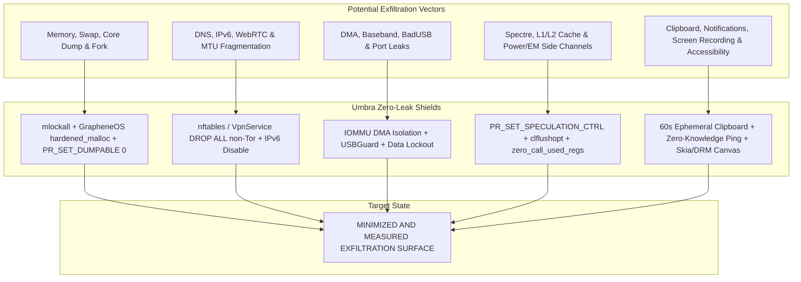

# Umbra Zero Data Leakage and Absolute Isolation Specification (Zero Data Leakage & Total Anti-Exfiltration)

This specification describes the defense mechanisms with which **Umbra**, running on both Linux and Android across the hardware, kernel, microarchitectural, memory, network, peripheral, and user-interface layers, **aims to minimize every conceivable form of Data Exfiltration / Leakage, and whose effectiveness is measured by leak tests**.

---

## 🌐 Holistic Zero-Leak Defense Matrix

---

## 1. Memory and OS-Level Leak Prevention (Memory & OS Anti-Leak)

| Exfiltration Vector | Threat Scenario | Umbra Mandatory Measure |
|---|---|---|
| **Swap / Page File Leak** | Keys or messages in RAM being written to disk as `/swapfile`. | All process memory is locked into RAM with `mlockall(MCL_CURRENT | MCL_FUTURE)`; the Linux swap space is ignored, and zRAM is encrypted on Android. |
| **Core Dump / Crash Dump** | The kernel writing a memory dump to disk on an unexpected signal. | Dump generation is blocked at the deepest level with `prctl(PR_SET_DUMPABLE, 0)`, `setrlimit(RLIMIT_CORE, 0)`, and `MADV_DONTDUMP`. |
| **Process Fork Leak** | The child process copying key memory when `fork()` is called. | With `MADV_DONTFORK` and `MADV_WIPEONFORK`, memory in the forked child process is instantly wiped with `0x00`. |
| **Memory Merging (KSM) Side Channel** | Linux KSM merging identical pages and creating a timing leak. | Memory deduplication is strictly forbidden via the `MADV_UNMERGEABLE` flag. |
| **CPU Register Residue** | Keys lingering in the `rax`, `ymm`, `zmm` registers after a function finishes. | With the LLVM `-Z zero-call-used-regs=all` compiler flag, all CPU registers are zeroed instantly on function exit. |
| **Heap / Dynamic Memory Corruption** | Memory reads via heap overflow or Use-After-Free. | The **GrapheneOS `hardened_malloc`** global allocator (`PROT_NONE` guard pages, out-of-line metadata, `zero_on_free`, quarantine queue). |

---

## 2. Network, DNS, and Metadata Leak Prevention (Network & Metadata Anti-Leak)

1. **DNS and DoH/DoT Leak Prevention:**
   - Standard system DNS resolvers (`/etc/resolv.conf`, `systemd-resolved`, Android `DnsResolver`) are bypassed entirely.
   - All domain-name and `.onion` resolution is performed end-to-end encrypted **solely through the local Arti Tor SOCKS5 tunnel** (`127.0.0.1:9050`).
   - All direct packets leaving for UDP 53 or the DoH/DoT ports are `DROP`ped in the kernel.
2. **IPv6 and WebRTC Leak Prevention:**
   - `net.ipv6.conf.all.disable_ipv6 = 1` is enforced in the kernel and the `ip6tables -P OUTPUT DROP` rule is applied.
   - The STUN, TURN, and ICE protocols are prevented from disclosing local interface IPs.
3. **Kernel-Level Hardware Kill-Switch:**
   - On Linux via `nftables` / `iptables`, on Android via the `VpnService` loopback socket:
   - **ALL outbound and inbound TCP, UDP, ICMP, and raw packets other than the embedded Arti Tor client's `127.0.0.1` socket are dropped instantly (`DROP ALL`)**.
4. **Packet Size and Timing Analysis Leak:**
   - Every packet, without exception, is locked to the **1024-byte fixed block size** (MTU fragmentation is forbidden via `IP_PMTUDISC_DO`).
   - Real messaging times and data sizes are masked with Poisson-distributed artificial cover traffic (**WTF-PAD Adaptive Padding**).

---

## 3. Hardware, Port, and DMA Exfiltration Prevention (Hardware & DMA Anti-Exfiltration)

1. **Baseband Modem & Cellular DMA Isolation:**
   - The cellular baseband modem's access to the main processor (AP) memory is isolated via **IOMMU / SMMU** hardware tables; DMA-based memory dumps are blocked.
2. **BadUSB & Thunderbolt / PCIe Port Leaks:**
   - On Linux, unauthorized USB peripherals are blocked via the `USBGuard` rule set; external hardware DMA access is cut off with `disable_early_pci_dma`.
   - On Android, USB data lines are hardware-disabled while the device is locked (**USB Data Lockout**).
3. **Camera, Microphone, and Sensor Isolation:**
   - The microphone and camera open only on an active user action; the moment the operation ends, the hardware is shut off and the buffer memory is `zeroize`d.
   - Artificial microsecond-scale noise (**Touch Noise Jitter**) is injected into accelerometer and gyroscope data, preventing motion-sensor eavesdropping.

---

## 4. Microarchitectural and CPU Side-Channel Leak Prevention (Microarchitectural Anti-Leak)

1. **Speculative Execution Attacks (Spectre / Meltdown / Retbleed):**
   - `prctl(PR_SET_SPECULATION_CTRL, PR_SPEC_STORE_BYPASS, PR_SPEC_FORCE_DISABLE, 0, 0)` and `PR_SPEC_INDIRECT_BRANCH` are enforced at the kernel level, blocking memory leaks through speculative branching.
2. **L1/L2 and LLC Cache Timing Leaks:**
   - Sensitive keys are never kept in plaintext in memory; they are encrypted on the fly with AES-NI and, immediately after being processed in the CPU cache, evicted from the cache with `clflushopt` (Cache Line Flush).
   - All cryptographic comparisons run constant-time via `subtle::ConstantTimeEq`, verified with a Welch t-test ($p < 10^{-5}$).
3. **Polynomial Masking (Masked Kyber):**
   - ML-KEM-768 matrix computations are split and run with random mask polynomials, minimizing electromagnetic (EM) and power-analysis (DPA) leaks.

---

## 5. UI, Clipboard, and Notification Leak Prevention (UI & Clipboard Anti-Leak)

1. **1-Minute Automatic Clipboard Destruction (Ephemeral Clipboard):**
   - Data handed to the clipboard is zeroed with `0x00` by a 60-second asynchronous counter.
   - On Android, the `ClipDescription.EXTRA_IS_SENSITIVE = true` flag stops the system from generating previews and saving the clipboard to history.
2. **Zero-Knowledge Masked Notifications:**
   - The real message text or sender identity is NEVER given to the operating system (Android `NotificationManager` / Linux D-Bus); only generic system notifications are delivered (`VISIBILITY_SECRET`).
3. **Screen Capture and Accessibility Snooping Prevention:**
   - **Android:** `FLAG_SECURE` + 60Hz/120Hz Temporal Pixel Interleaving + Android 14+ `ScreenCaptureCallback` + Custom Skia Native Canvas (empty `AccessibilityNodeInfo` tree) + Hardware DRM/TEE GPU Surface.
   - **Linux:** Wayland only (`WAYLAND_DISPLAY`); X11 and PipeWire/Portal screen-capture requests are rejected instantly.
4. **Universal 24-Hour Crypto-Shredding:**
   - All messages, photos, videos, and documents are irreversibly destroyed after 24 hours, referenced against Tor Consensus Time, by deleting the $EFK$ keys and applying the NIST SP 800-88 3-pass overwrite.
