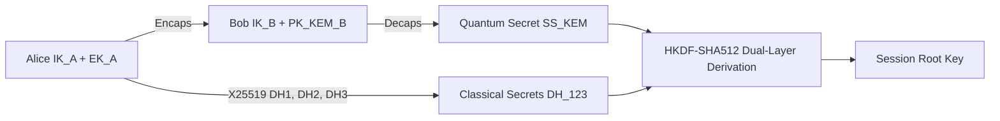

# Umbra Advanced Cryptography Specification

This document describes the post-quantum hybrid encryption mechanisms used by the **Umbra** protocol, its Post-Quantum digital signatures, its group communication model (PQ-MLS TreeKEM), and its deniability models.

---

## 1. Cryptographic Primitives

| Function | Algorithm | Library / Standard | Security Level |
|---|---|---|---|
| **Classical Key Exchange** | Curve25519 (X25519 ECDH) | `x25519-dalek` (RFC 7748) | 128-bit Classical |
| **Post-Quantum KEM** | ML-KEM-768 (CRYSTALS-Kyber-768) | NIST FIPS 203 (`ml-kem` — RustCrypto, pure Rust) | Level 3 (Quantum, AES-192 equivalent) |
| **Post-Quantum Signatures** | ML-DSA-65 (CRYSTALS-Dilithium-3) | NIST FIPS 204 (`ml-dsa` — RustCrypto, pure Rust) | Level 3 Quantum-Resilient |
| **Fallback Hash-Based Signature** | SLH-DSA / SPHINCS+ | NIST FIPS 205 (`slh-dsa` — RustCrypto, pure Rust) | Stateless Hash-Based (security reduces to the preimage/second-preimage security of the underlying hash functions — no known structured mathematical attack) |
| **Symmetric AEAD Encryption** | ChaCha20-Poly1305 | `chacha20poly1305` (RFC 8439) | 256-bit Authenticated Encryption |
| **Key Derivation (KDF)** | HKDF-SHA512 & BLAKE3 | `hkdf` / `blake3` | High-Entropy KDF |
| **Password-Based KDF** | Argon2id ($t=4, m=2^{18}, p=4$) | `argon2` (RFC 9106) | Memory-Hard (ASIC/GPU Protected) |
| **Constant-Time Equality** | Constant-Time Comparison | `subtle::ConstantTimeEq` | Constant-Time (AEAD verify path and SAS derivation verified by the dudect suite, `constant_time_tests.rs`; X25519/ML-KEM/ML-DSA rely on upstream constant-time implementations; SMP modexp is a documented non-CT residual) |

> **Note (ADR-026):** Due to the language policy, C-based `pqcrypto-*` (PQClean) wrappers are not used; for the post-quantum algorithms, only pure Rust RustCrypto implementations are mandated. FIPS 203/204/205 compliance is verified with Known-Answer Test (KAT) vectors.

---

## 2. Post-Quantum Hybrid Handshake (PQXDH)

Umbra implements the hybrid **PQXDH** protocol, which combines the strengths of classical and post-quantum algorithms:

> **Residual note (ADR-029, identity generation):** generated identity bytes transit the stack through the Rust ABI return slot before reaching their final home; safe Rust cannot eliminate this. The compensating controls are the ADR-025 memory-hardening layers, and the residual is accepted.

1. **Hybrid Root Key Formula:**
   $$SK = \text{HKDF-SHA512}(\text{ROOT\_SALT},\ DH_1 \parallel DH_2 \parallel DH_3 \parallel SS_{\text{ML-KEM}},\ \text{ROOT\_INFO})$$
2. **Post-Quantum Security Property (conditional):**
   IF an adversary solves the X25519 elliptic curve with a future quantum computer, reaching the session secret still requires breaking ML-KEM-768's lattice problem (AES-192-equivalent, per NIST FIPS 203 security category 3). This is a conditional reduction, not an unconditional guarantee — it holds as long as ML-KEM stands and the implementation matches the specification.

### 2.1 Double Ratchet Delivery Semantics

- The session root key boots the Signal-spec Double Ratchet (DH ratchet + symmetric chains; single-use message keys with deterministically derived nonces). Decryption is transactional (spec §3.5): on authentication failure all state changes are discarded.
- Out-of-order delivery decrypts via a bounded skipped-key store: message keys for gaps are pre-derived and held (max 128 per receiving chain, 256 total; oldest evicted first — a bounded-memory DoS trade-off). Replayed or evicted-too-old messages fail closed (`DecryptFailed`).
- A message lost beyond the store is unrecoverable **by design**: no automatic in-band resync exists — a new session must be established (fresh PQXDH handshake, same pairing; every messenger stream already opens one).

---

## 3. Post-Quantum Asynchronous Group Communication (PQ-MLS TreeKEM)

For multiple secure cells and diplomatic working groups, Umbra combines the IETF **Messaging Layer Security (MLS, RFC 9420)** protocol with a hybrid post-quantum TreeKEM ciphersuite. The single-cell increment (TODO B.2, ADR-033) has landed as `crates/umbra-group`, built on OpenMLS 0.9.0 with the pure-Rust `libcrux-provider` — no from-scratch TreeKEM/Sphinx-style reimplementation.

- **Tree Structure (TreeKEM):** Group members are defined as leaf nodes in a binary key tree, exactly as specified by RFC 9420; Umbra adds no protocol-level changes on top of OpenMLS's tree logic.
- **Logarithmic Scaling ($O(\log N)$):** When a member is added, only the tree path is updated instead of re-distributing keys to the entire group from scratch — inherited unmodified from OpenMLS. **Removal is not yet implemented** (see the scope note below), so this property is currently exercised only for the add path.
- **Group Forward Secrecy:** OpenMLS advances the secret tree on every processed message (not only on Commits — an application message's decryption is itself a required storage-mutating step), so `umbra-group` re-persists group state after every processed inbound frame, not just after membership changes.
- **Ciphersuite (partial PQ — honest caveat, not aspirational):** `MLS_256_XWING_CHACHA20POLY1305_SHA256_Ed25519` — **X-Wing** (the hybrid X25519 + ML-KEM-768 KEM) protects the TreeKEM path/HPKE layer, but leaf-node and message **signatures remain classical Ed25519**. This is the full extent of post-quantum coverage currently available in OpenMLS's ciphersuite catalog: `draft-ietf-mls-pq-ciphersuites` defines hybrid *KEM* ciphersuites only — there is no standardized post-quantum *signature* ciphersuite for MLS yet. Consequence: group message content is protected against harvest-now/decrypt-later via the KEM's PQ leg, but an adversary who later breaks classical ECDLP could retroactively forge handshake authentication (leaf-node credentials, Commit/Welcome signatures). This is a weaker posture than PQXDH's two-party hybrid (§2), which pairs the KEM with Umbra's own ML-DSA-backed identity layer rather than delegating authentication entirely to the transport protocol's own ciphersuite. **Migration plan:** re-evaluate once OpenMLS ships a full post-quantum MLS ciphersuite (KEM and signature); tracked in ADR-033 and TODO B.2.
- **Wire integration:** group traffic shares `umbra-net`'s existing two-party raw-stream transports (Tor today; see the scope note below) via a new leading connection-type marker byte (`umbra_net::messenger::peek_connection_type`, `CONNECTION_TYPE_PQXDH` vs. `CONNECTION_TYPE_GROUP`) — the first change to that wire format since its original design (ADR-033).
- **Persistence:** an entire group's OpenMLS state (its in-memory `MemoryStorage` map) plus Umbra's own peer-name↔leaf-index roster are serialized as one AEAD-encrypted blob per group, rather than a hand-implemented 80-plus-method `StorageProvider` (ADR-033 explains why).
- **Honest scope — what this increment does NOT cover (tracked, not hidden; see TODO B.2 for the full list):** member removal, key rotation, sub-groups, large-group scalability testing, a full post-quantum signature ciphersuite, and inbound group-frame handling over the mesh/Nym transports (Tor-only for now). Most notably: a member who joins an existing cell via an inbound `Welcome` receives an **empty** local roster (Umbra's own peer-name bookkeeping is never carried by MLS itself, and nothing yet populates it for the joining side — see `crates/umbra-group/src/inbound.rs`'s module docs) — that member can receive and decrypt group traffic, but their own outbound sends fan out to zero peers until a future roster-bootstrapping mechanism exists. See `THREAT_MODEL.md` and `TODO.md` B.2 for the full, itemized residual list.

---

## 4. Anonymous Device Attestation with Zero-Knowledge Proofs (Zk-Attestation)

- Device pairing is designed to use **Zk-SNARKs / Bulletproofs** to verify that the other party is a secure Umbra client (v2+ scope per ADR-027; not implemented in v1.0).
- Without revealing its fingerprint or serial number, the device mathematically presents the proof *"I have a valid hardware/software configuration"*.

---

## 5. Socialist Millionaire Protocol (SMP) and SAS Verification

Against man-in-the-middle (MITM) attacks:
- If the two parties are physically side by side, a one-time dynamic **QR Code** is scanned.
- If the two parties are remote, a 6-digit visual/numeric **SAS (Short Authentication String)** code is used, or **SMP (Socialist Millionaire Protocol)** is run over a mutually shared secret password. SMP proves with zero knowledge that both parties know the same password, without disclosing it to the other party.
- Scope note: the SMP engine (`umbra-protocol::smp`, a faithful OTR v3 transcription) proves **shared-secret knowledge**. Its MITM value depends on the secret being authenticated out of band and on the identities bound into it: `smp::bound_secret` derives the pairing-level material from the shared password plus both parties' canonical identity fingerprints (`kdf::identity_fingerprint`, ML-DSA-VK+IK, 256-bit BLAKE3) taken from out-of-band-verified peer records, and the session driver additionally mixes the per-handshake transcript SSID (`Session::transcript_ssid`, BLAKE3 of the PQXDH blob) so a relay forwarding SMP messages verbatim between two distinct sessions fails on both sides. Residual: fingerprints are public and the password remains the root of trust — anyone holding the password passes SMP by design.
